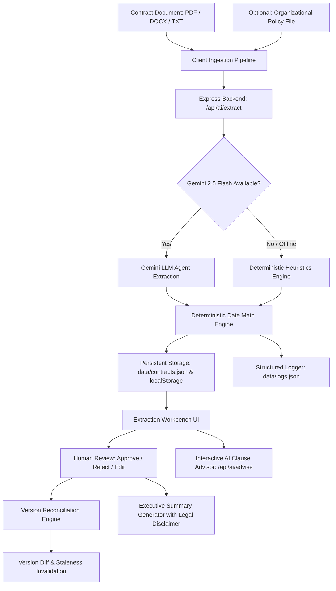

# Contract Obligation & Renewal Assistant (Aggroso)

> **Full-Stack Enterprise Contract Intelligence, Deterministic Renewal Engine & AI Agent Workstation**  
> An intelligent contract review platform featuring an interactive React 19 frontend, an Express.js backend with persistent storage, a Google Gemini 2.5 Flash AI Agent workflow, deterministic deadline computations, policy compliance benchmarking, automatic approval invalidation (staleness tracking), and structured operational logging.

[](https://vitejs.dev/)
[](https://react.dev/)
[](https://expressjs.com/)
[](https://ai.google.dev/)
[](https://www.typescriptlang.org/)

---

> [!IMPORTANT]
> ### Information-Management Tool Notice & Disclaimer
> This tool is an **information-management and operational workflow assistant**. It provides automated data extraction, deterministic calendar deadline calculations, and policy-rule comparison assistance.  
> **IT DOES NOT PROVIDE LEGAL ADVICE, LEGAL INTERPRETATIONS, OR FORMAL LEGAL COUNSEL.**  
> All extracted dates, obligations, and risk flags represent algorithmic extractions and must be reviewed, verified, and approved by qualified procurement and legal professionals prior to making commercial or legal commitments.

---

## Table of Contents
- [1. Setup & Quick Start](#1-setup--quick-start)
- [2. System Architecture](#2-system-architecture)
- [3. Completed vs. Excluded Scope](#3-completed-vs-excluded-scope)
- [4. Automated Verification Suite (Tests)](#4-automated-verification-suite-tests)
- [5. System Limitations](#5-system-limitations)
- [6. Deployment Details](#6-deployment-details)

---

## 1. Setup & Quick Start

### Prerequisites
- **Node.js**: v18.0.0 or higher (v20+ / v24+ recommended)
- **npm**: v9.0.0 or higher
- **Gemini API Key**: Configured in `.env` (optional; falls back gracefully to local deterministic heuristics if key is missing or offline).

### Local Installation

1. **Clone the repository**:
   ```bash
   git clone https://github.com/raushankr121/Contract-Analyzer.git
   cd Contract-Analyzer
   ```

2. **Install dependencies**:
   ```bash
   npm install
   ```

3. **Configure Environment Variables**:
   Create a `.env` file in the root directory:
   ```env
   GEMINI_API_KEY=your_gemini_api_key_here
   PORT=3001
   VITE_GEMINI_API_KEY=your_gemini_api_key_here
   ```

4. **Start the Development Servers (Frontend + Backend)**:
   ```bash
   npm run dev
   ```
   *This concurrently starts the Express backend API on port `3001` and Vite client on port `5173` with reverse proxy.*

   > **Windows PowerShell Users:** If PowerShell prevents script execution (`npm.ps1 cannot be loaded`), run:
   > ```powershell
   > npm.cmd run dev
   > ```
   > *(or run `Set-ExecutionPolicy -Scope Process -ExecutionPolicy Bypass` in your session).*

5. **Open in browser**:
   Navigate to **[http://localhost:5173](http://localhost:5173)**.

### Available Scripts

| Command | Description |
| :--- | :--- |
| `npm run dev` | Runs both Express backend (`:3001`) and Vite client (`:5173`) concurrently |
| `npm run dev:client` | Starts only the Vite frontend development server |
| `npm run dev:server` | Starts only the Express backend API server |
| `npm run test:all` | Runs both frontend and backend verification test suites |
| `npm test` | Runs the 8-suite frontend & algorithmic verification suite |
| `npm run test:backend` | Runs the backend persistence, logs, and Gemini AI agent test suite |
| `npm run build` | Compiles TypeScript and creates optimized production assets in `dist/` |
| `npm run lint` | Runs `oxlint` for high-performance static analysis |
| `npm run preview` | Spins up a local static server to preview the production build |

---

## 2. System Architecture

### Architectural Principles
1. **Full-Stack Separation of Concerns**: A fast React 19 single-page application paired with a dedicated Express.js backend providing RESTful endpoints for contract storage, policy management, structured audit logging, and LLM orchestration.
2. **Dual-Layer Persistence**: State is persisted automatically to the file-backed JSON database (`data/contracts.json`, `data/policy.json`, and `data/logs.json`) on the backend, and mirrored to browser `localStorage` as an offline resilience layer. Refreshing the browser or restarting the server never wipes state.
3. **Hybrid AI Agent Architecture**: 
   - **Google Gemini 2.5 Flash**: Orchestrates complex clause comprehension, entity extraction, ambiguity spotting, and interactive clause negotiation advisory.
   - **Deterministic Mathematical Core**: Hardens date calculations (`Expiry Date - Notice Window Days = Non-Renewal Cutoff`) with transparent formulas rather than probabilistic hallucinations.
   - **Resilient Fallback**: Automatically falls back to deterministic rule extraction if offline or if the Gemini API is unreachable.
4. **Human-in-the-Loop Governance**: Every AI-generated finding enters a `PENDING` state with a certainty rating (`CONFIRMED` vs. `UNCERTAIN_INTERPRETATION`). Changes across versions automatically trigger `STALE` invalidation requiring human re-approval.
5. **Structured Audit & Execution Logging**: Centralized chronological event logging tracks parser output, AI agent prompts, token usage, latency, and human approval timestamps.

### System Flow Diagram



### Module Structure

```
aggroso/
├── data/                          # Persistent File-Backed Database (Git Ignored)
│   ├── contracts.json             # Persisted contract versions and audit history
│   ├── policy.json                # Persisted active organizational policy
│   └── logs.json                  # Structured system and AI agent execution logs
├── server/                        # Express.js Backend API
│   ├── server.ts                  # REST API routes (Health, Contracts, Policy, AI, Logs)
│   ├── geminiService.ts           # Google Gemini 2.5 Flash integration & fallback logic
│   ├── storage.ts                 # JSON database engine and structured logger
│   └── testBackend.ts             # Backend and persistence automated test suite
├── src/                           # React 19 Frontend
│   ├── components/                # Presentation and interactive UI components
│   │   ├── DocumentIntakeHero.tsx     # Intake portal with drag-and-drop & preloaded samples
│   │   ├── ExtractionWorkbench.tsx    # Clause review workspace with AI Advisor buttons
│   │   ├── DeadlinesTimeline.tsx      # Chronological timeline & reminder alerts (90d, 60d, 30d, 7d)
│   │   ├── ConflictsClarifications.tsx# Ambiguity and procurement policy cross-checking
│   │   ├── VersionDiffView.tsx        # Version redline diff & stale approval tracking
│   │   ├── ReviewedSummaryView.tsx    # Executive summary report with markdown export
│   │   ├── DocumentViewer.tsx         # Raw source text viewer with section lookup
│   │   ├── LogsDrawer.tsx             # Real-time structured logs and AI stream inspector
│   │   ├── AiConsultantModal.tsx      # Interactive clause negotiation advisor (Gemini)
│   │   ├── OperationalDatesModal.tsx  # Ingestion modal for contracts with unstated placeholders
│   │   ├── EditItemModal.tsx          # Human-in-the-loop modal to edit terms and add citations
│   │   ├── UploadModal.tsx            # Modal for uploading new versions and policies
│   │   ├── DisclaimerBanner.tsx       # Persistent information-management notice banner
│   │   ├── StatCards.tsx              # KPI overview metrics (obligations, critical dates, risks)
│   │   └── Header.tsx                 # Header navigation, version switcher & logs trigger
│   ├── services/
│   │   └── api.ts                 # Full-stack API client, dual-persistence, and event logger
│   ├── types/
│   │   └── contract.ts            # TypeScript domain models (Versions, Dates, Clauses, Statuses)
│   └── utils/
│       ├── contractExtractor.ts   # Rule-based extraction engine & ambiguity detection
│       ├── deterministicDate.ts   # Exact calendar math, reminder generator, formula builder
│       ├── documentParser.ts      # Bundled PDF.js worker & Mammoth DOCX extraction pipeline
│       ├── versionManager.ts      # Redline comparison & stale status invalidation engine
│       ├── summaryGenerator.ts    # Markdown summary report builder with mandatory disclaimers
│       ├── sampleContracts.ts     # Pre-loaded enterprise SaaS & 14-page Healthcare HMO contracts
│       └── testRunner.ts          # 8-suite automated frontend test verification runner
├── .env.example                   # Environment configuration template
├── package.json                   # Full-stack scripts and dependencies
├── vite.config.ts                 # Vite bundler configuration with backend API proxy
└── vercel.json                    # Single-Page Application (SPA) routing configuration
```

---

## 3. Completed vs. Excluded Scope

### Completed Scope

| Feature Area | Implementation Highlights |
| :--- | :--- |
| **Usable Frontend** | High-performance React 19 + TypeScript dashboard with tabs, modals, viewer, redline diff, timeline, and AI inspection drawer. |
| **Working Backend** | Express.js API server running on port `3001` handling contract CRUD, policy storage, structured logging, and Gemini AI agent coordination. |
| **Data Persistence** | Automatic dual persistence: writes to server disk (`data/contracts.json`, `data/policy.json`, `data/logs.json`) and browser `localStorage`. Survives page refreshes and server reboots. |
| **Functional AI Agent** | Live integration with Google Gemini 2.5 Flash for contract clause extraction and interactive clause risk advisory, paired with deterministic arithmetic. |
| **Human Review & Approval** | Explicit review workflow (`PENDING`, `APPROVED`, `REJECTED`, `EDITED`, `STALE`), user edit modal, audit logging, and bulk approval actions. |
| **Version Invalidation (Staleness)** | Compares v1 against v2 amendments; automatically invalidates previously approved items into `STALE` when underlying contract terms change. |
| **Multi-Tier Reminder Engine** | Computes operational reminder countdowns (Critical, Warning, Info) across standard notice thresholds (90d, 60d, 30d, 7d before decision cutoffs). |
| **Verbatim Citations** | 100% of extracted items retain exact section headers and verbatim quotations for direct human verifiability. |
| **Structured Application Logs** | Chronological event logger with dedicated UI drawer (`LogsDrawer.tsx`), level filtering (`AI_AGENT`, `AUDIT`, `ERROR`, `WARN`, `INFO`), and JSON export. |
| **States & Error Handling** | Comprehensive loading overlays, empty intake states, file validation, error catches, and resilient fallback to local heuristics. |

### Excluded Scope (Out of Scope by Design)

- **No Legal Counsel / Statutory Advice**: The system does not assess legal enforceability, statutory compliance by jurisdiction, or offer legal opinions.
- **No Cloud Multi-Tenant Database**: Intentionally relies on local storage to preserve client confidentiality and satisfy strict enterprise procurement requirements.
- **No OCR for Flattened Image Scans**: Optical Character Recognition for flattened photocopies without digital text layers is excluded.
- **No Electronic Signature Integration**: The tool operates as an upstream governance workstation and does not integrate with DocuSign or Adobe Sign.
- **No Autonomous Commercial Dispatch**: The system produces actionable reminders and draft clarification questions, but does not autonomously send notices to external parties without human approval.

---

## 4. Automated Verification Suite (Tests)

The system includes both frontend/algorithmic and backend test suites, executable via a single command:

```bash
npm run test:all
```

### 1. Frontend & Algorithmic Suite (`src/utils/testRunner.ts`)
Run independently with `npm test`:
- **Test 1: Deterministic Date Math**: Validates that `2027-05-31` with a `60-day` notice window outputs exactly `2027-04-01`.
- **Test 2: Policy Ingestion & Cross-Rule Extraction**: Tests extraction of mandatory benchmark rules with exact section citations.
- **Test 3: Contract v1 Extraction**: Asserts 100% citation and quote coverage across all identified parties, dates, renewal terms, and obligations.
- **Test 4: Certainty Level Distinction**: Verifies differentiation between confirmed vs. conditional obligations and ensures targeted clarification questions are generated.
- **Test 5: Version Reconciliation & Staleness Invalidation**: Confirms that modified clauses in v2 are automatically downgraded from `APPROVED` to `STALE`.
- **Test 6: Reviewed Contract Summary**: Verifies summary generation and legal disclaimer enforcement.
- **Test 7: 14-Page Healthcare HMO Contract**: Tests complex real-world contracts, capturing donor audit obligations and invoice forfeiture clauses.
- **Test 8: Template Contracts with Unstated Dates**: Verifies handling of placeholder lines (`"_____"` and `"XXX"`) with `NO_RENEWAL` classification.

### 2. Backend & Persistence Suite (`server/testBackend.ts`)
Run independently with `npm run test:backend`:
- **Test 1: Structured Log Persistence**: Verifies append and retrieval of structured logs from `data/logs.json`.
- **Test 2: Contracts CRUD Persistence**: Tests saving and reloading contract versions from `data/contracts.json`.
- **Test 3: Organizational Policy Persistence**: Validates policy persistence in `data/policy.json`.
- **Test 4: Gemini AI Agent Workflow Execution**: Tests live Gemini 2.5 Flash API extraction, token logging, and deterministic fallback.

---

## 5. System Limitations

1. **Scanned Image PDFs**: Documents must contain a digital text layer. Image-only PDFs from flatbed scanners without OCR cannot be parsed.
2. **Tabular Geometry in PDFs**: Complex multi-column tabular data in non-standard PDFs may be extracted in top-to-bottom stream order.
3. **Browser Memory Boundaries**: Documents over 100MB or exceeding 1,000 pages may experience rendering delays in client-side memory.

---

## 6. Deployment Details

### Production Build
To create an optimized production bundle:
```bash
npm run build
```
The compiled frontend bundle is emitted to `dist/`.

### Hosting Options
- **Vercel**: Frontend SPA is preconfigured with [`vercel.json`](file:///e:/aggroso/vercel.json) for client-side routing rewrites.
- **Node.js Production Server**: Start the Express backend with `node --loader tsx server/server.ts` or compile via `tsc` to serve both API routes and static `dist/` assets.
- **Docker / Container**: Package Node.js 20+ with `npm run build` and launch `npm run dev:server`.
