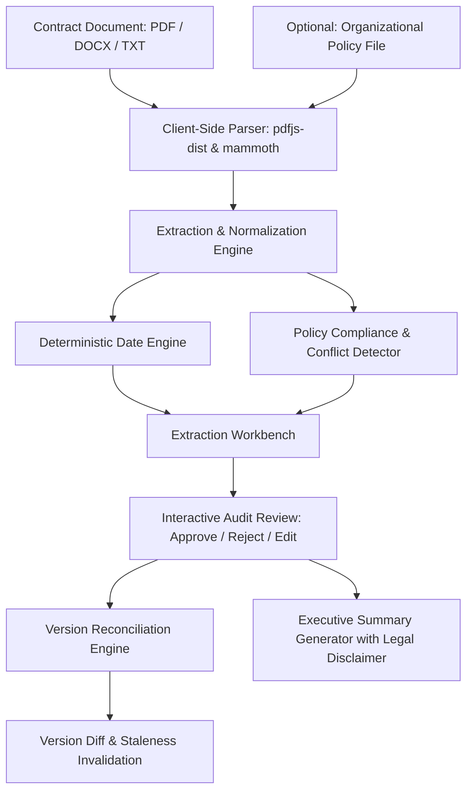

# Contract Obligation & Renewal Assistant (Aggroso)

> **Enterprise Contract Information-Management & Deterministic Renewal Engine**  
> An intelligent, client-side contract review workstation that extracts operational obligations, computes deterministic renewal and termination deadlines, benchmarks against organizational policies, invalidates stale approvals across versions, and produces auditable summaries.

[](https://vitejs.dev/)
[](https://react.dev/)
[](https://www.typescriptlang.org/)
[](LICENSE)

---

> [!IMPORTANT]
> ### Information-Management Tool Notice & Disclaimer
> This tool is an **information-management and operational workflow assistant**. It provides automated data extraction, deterministic calendar deadline calculations, and policy-rule comparison assistance.  
> **IT DOES NOT PROVIDE LEGAL ADVICE, LEGAL INTERPRETATIONS, OR FORMAL LEGAL COUNSEL.**  
> All extracted dates, obligations, and risk flags represent algorithmic extractions and must be reviewed, verified, and approved by qualified procurement and legal professionals prior to making commercial or legal commitments.

---

## Table of Contents
- [1. Setup & Quick Start](#1-setup--quick-start)
- [2. System Architecture](#2-system-architecture)
- [3. Completed vs. Excluded Scope](#3-completed-vs-excluded-scope)
- [4. Automated Verification Suite (Tests)](#4-automated-verification-suite-tests)
- [5. System Limitations](#5-system-limitations)
- [6. Deployment Details](#6-deployment-details)

---

## 1. Setup & Quick Start

### Prerequisites
- **Node.js**: v18.0.0 or higher (v20+ / v24+ recommended)
- **npm**: v9.0.0 or higher

### Local Installation

1. **Clone the repository**:
   ```bash
   git clone https://github.com/raushankr121/Contract-Analyzer.git
   cd Contract-Analyzer
   ```

2. **Install dependencies**:
   ```bash
   npm install
   ```

3. **Start the local development server**:
   ```bash
   npm run dev
   ```
   > **Windows PowerShell Users:** If PowerShell prevents script execution (`npm.ps1 cannot be loaded`), run:
   > ```powershell
   > npm.cmd run dev
   > ```
   > *(or run `Set-ExecutionPolicy -Scope Process -ExecutionPolicy Bypass` in your session).*

4. **Open in browser**:
   Navigate to **[http://localhost:5173](http://localhost:5173)**.

### Available Scripts

| Command | Description |
| :--- | :--- |
| `npm run dev` | Starts the Vite development server with HMR at `http://localhost:5173` |
| `npm run build` | Compiles TypeScript and creates optimized production assets in `dist/` |
| `npm test` | Executes the 8-suite automated contract verification test suite |
| `npm run lint` | Runs `oxlint` for high-performance static analysis |
| `npm run preview` | Spins up a local static server to preview the production build |

---

## 2. System Architecture

### Architectural Principles
1. **Privacy-First Zero-Server Footprint**: All document parsing (PDF and DOCX) and data extraction run **100% locally in the browser**. No confidential contracts, NDAs, or proprietary vendor terms are ever transmitted to third-party LLM cloud APIs or external servers.
2. **Deterministic Arithmetic**: Renewal deadlines and reminder cutoffs are calculated through exact date arithmetic (`Expiry Date - Notice Window Days = Non-Renewal Cutoff`), accompanied by transparent formulas rather than probabilistic predictions.
3. **Citation & Audit Trail**: Every extracted entity includes its verbatim source quote and exact document section citation to enable instant human verification.

### System Flow Diagram



### Module Structure

```
src/
├── components/                    # UI Presentation & Interaction Layer
│   ├── DocumentIntakeHero.tsx     # Drag-and-drop ingestion, samples & feature highlights
│   ├── ExtractionWorkbench.tsx    # Core workspace for reviewing parties, dates & obligations
│   ├── DeadlinesTimeline.tsx      # Chronological timeline & reminder alerts (90d, 60d, 30d, 7d)
│   ├── ConflictsClarifications.tsx# Ambiguity and policy deviation analysis
│   ├── VersionDiffView.tsx        # Version redline diff & stale approval tracking
│   ├── ReviewedSummaryView.tsx    # Executive summary report with markdown export
│   ├── DocumentViewer.tsx         # Raw source text viewer with section lookup
│   ├── OperationalDatesModal.tsx  # Ingestion modal for contracts with unstated placeholders
│   ├── EditItemModal.tsx          # Human-in-the-loop modal to edit terms and add citations
│   ├── UploadModal.tsx            # Modal for uploading new versions and policies
│   ├── DisclaimerBanner.tsx       # Persistent legal notice banner
│   ├── StatCards.tsx              # KPI overview metrics (obligations, critical dates, risks)
│   └── Header.tsx                 # Header navigation & tab switching
├── types/
│   └── contract.ts                # TypeScript domain models (Versions, Dates, Clauses, Statuses)
└── utils/
    ├── contractExtractor.ts       # Extraction rules, certainty scoring, conflict identification
    ├── deterministicDate.ts       # Exact calendar math, reminder generator, formula builder
    ├── documentParser.ts          # Bundled PDF.js worker & Mammoth DOCX extraction pipeline
    ├── versionManager.ts          # Redline comparison & stale status invalidation engine
    ├── summaryGenerator.ts        # Markdown summary report builder with mandatory disclaimers
    ├── sampleContracts.ts         # Pre-loaded enterprise SaaS & 14-page Healthcare HMO contracts
    └── testRunner.ts              # 8-suite automated test verification runner
```

---

## 3. Completed vs. Excluded Scope

### Completed Scope

| Feature Area | Implementation Highlights |
| :--- | :--- |
| **Multi-Format Ingestion** | In-browser parsing of native `.pdf` (using bundled local `pdfjs-dist` worker), `.docx` (via `mammoth`), `.txt`, and raw pasted text. |
| **Deterministic Deadline Math** | Computes exact cutoff dates: `Notice Deadline = Expiry Date - Advance Notice Days`. Formulates transparent calculation strings and flags leap years/calendar boundaries. |
| **Multi-Tier Reminder Engine** | Generates operational reminder alerts (Critical, Warning, Info) across standard notice thresholds (90d, 60d, 30d, 7d before decision cutoffs). |
| **Source Citation & Verifiability** | Every extracted item retains an `exactQuote` and `citation` (e.g. `Section 4.1`, `Schedule I`), allowing direct verification against the document. |
| **Certainty & Clarification** | Distinguishes `CONFIRMED` obligations from `UNCERTAIN_INTERPRETATION` items, automatically drafting operational clarification questions for counterparties. |
| **Policy Benchmark Comparison** | Ingests organizational procurement policies (e.g., standard payment terms, liability coverage caps) and flags contract deviations as `CRITICAL`, `HIGH`, `MEDIUM`, or `LOW`. |
| **Version Reconciliation & Diffing** | Compares v1 against v2 amendments; highlights changed clauses, detects added/removed obligations, and **automatically flags previously approved items as `STALE`** when underlying contract terms change. |
| **Human-in-the-Loop Audit Trail** | Allows users to `APPROVE`, `REJECT`, `EDIT`, or override values with a persistent timestamped audit log. |
| **Handling Unstated Template Dates** | Detects placeholder dates (`"____"`, `"XXX"`) and supports an interactive modal to supply operational dates deterministically without modifying source files. |
| **Executive Summary Export** | Generates audit-ready Markdown summaries including KPI metrics, obligation tables, and prominent information-management disclaimers. |

### Excluded Scope (Out of Scope by Design)

- **No Legal Counsel / Statutory Advice**: The system does not assess legal enforceability, statutory compliance by jurisdiction, or offer legal opinions.
- **No Remote Database / Cloud Storage**: Intentionally designed without a central multi-tenant database to guarantee client confidentiality and satisfy enterprise procurement security requirements.
- **No OCR for Flat Scanned PDFs**: Optical Character Recognition for flattened or rasterized photocopies without text layers is not included (requires embedded text streams).
- **No Electronic Signature Integration**: The tool does not connect directly to signing platforms (e.g., DocuSign, Adobe Sign); it operates as an upstream review and governance workstation.
- **No Automated Contract Execution**: The tool produces actionable alerts and summaries, but does not autonomously dispatch legal termination or renewal notices to external parties.

---

## 4. Automated Verification Suite (Tests)

The repository includes a comprehensive verification suite in [`src/utils/testRunner.ts`](file:///e:/aggroso/src/utils/testRunner.ts).

### Running Tests

```bash
npm test
```
*(Or run directly via `npx tsx src/utils/testRunner.ts`)*

### Verification Coverage (8 Test Suites — 100% Pass)

```
================================================================
RUNNING CONTRACT ASSISTANT AUTOMATED VERIFICATION SUITE
================================================================
```

1. **Test 1: Deterministic Date Math**
   - Validates that `2027-05-31` with a `60-day` notice window outputs exactly `2027-04-01` with explicit formula logging.
2. **Test 2: Policy Ingestion & Cross-Rule Extraction**
   - Tests extraction of mandatory benchmark rules (payment terms, cyber liability thresholds, notice windows) from policy text with exact section citations.
3. **Test 3: Contract v1 Extraction & AI Workflow**
   - Ingests `NexusCloud Agreement v1.0` and asserts 100% citation and quote coverage across all identified parties, dates, renewal terms, and obligations.
4. **Test 4: Certainty Level Distinction & Clarification Questions**
   - Verifies differentiation between confirmed vs. conditional obligations and ensures targeted clarification questions are generated for ambiguous terms.
5. **Test 5: Version Reconciliation & Staleness Invalidation**
   - Simulates approval of v1 terms, ingests `v2.0 Amendment`, and asserts that modified clauses are automatically downgraded from `APPROVED` to `STALE` with audit reasons.
6. **Test 6: Reviewed Contract Summary & Disclaimer Enforcement**
   - Ensures the generated Markdown summary contains the complete obligation table, audit state, and mandatory non-legal advice notice.
7. **Test 7: Complex 14-Page Healthcare HMO Service Contract Extraction**
   - Tests complex real-world contracts, accurately capturing donor audit obligations (7-year records retention) and strict 60-day invoice forfeiture clauses.
8. **Test 8: Template Contracts with Unstated Dates & Fixed Terms**
   - Verifies handling of template placeholder lines (`"_____"` and `"XXX"`), confirming that renewal clauses are classified as `NO_RENEWAL` with `N/A` deadlines.

---

## 5. System Limitations

1. **Client-Side Memory Limits**: Because parsing occurs within the browser runtime, exceptionally large documents (>100MB or >1,000 pages) may experience rendering delays depending on device RAM.
2. **Non-Text Scans (Flattened Images)**: Documents must contain a digital text layer. Scanned images from physical scanners without OCR cannot be parsed.
3. **Non-Standard Tabular Geometry**: Extremely complex multi-column tables in unstructured PDFs may be extracted in top-to-bottom stream order.
4. **Session Volatility**: State resides in browser memory during review; users should export reviewed summaries before clearing browser sessions or refreshing unpersisted state.

---

## 6. Deployment Details

Because the application compiles to static assets via Vite, it can be hosted on any modern static hosting provider or CDN.

### Deploying to Vercel (Configured)

The project includes a [`vercel.json`](file:///e:/aggroso/vercel.json) configuration for Single-Page Application (SPA) routing rewrites.

#### Method A: Via Vercel Web Dashboard (Recommended)
1. Go to [vercel.com/new](https://vercel.com/new) and log in with GitHub.
2. Under **Import Git Repository**, select `raushankr121/Contract-Analyzer`.
3. Vercel automatically detects the framework:
   - **Framework Preset**: `Vite`
   - **Root Directory**: `./`
   - **Build Command**: `npm run build`
   - **Output Directory**: `dist`
4. Click **Deploy**. Vercel will build the project and provide a production URL. Future pushes to `main` will automatically trigger preview and production deployments.

#### Method B: Via Vercel CLI
```powershell
# Login and deploy preview
npx.cmd vercel

# Deploy directly to production
npx.cmd vercel --prod
```

### Alternative Deployment Targets

- **Netlify**: Connect repository, set build command to `npm run build`, and publish directory to `dist`.
- **Cloudflare Pages**: Connect to repository with framework preset `Create React App / Vite`.
- **Docker / Nginx**: Build static bundle using `npm run build` and serve `/dist` with any Nginx or Caddy web server.

### Build Configuration Reference

| Environment Property | Value |
| :--- | :--- |
| **Node Version** | `18.x`, `20.x`, or `22.x` |
| **Build Command** | `npm run build` |
| **Output Directory** | `dist` |
| **SPA Fallback** | `index.html` (handled via `vercel.json`) |
